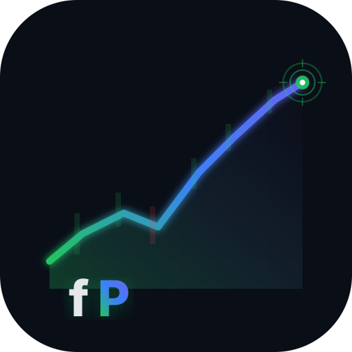
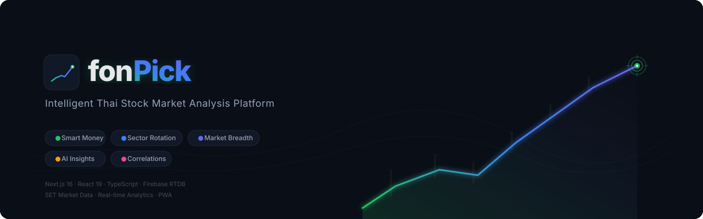

<div align="center">

  

  # fonPick

  ### Intelligent Thai Stock Market (SET) Analysis Platform

  <br/>

  

  <br/><br/>

  [](https://nextjs.org/)
  [](https://react.dev/)
  [](https://www.typescriptlang.org/)
  [](https://firebase.google.com/)
  [](https://tailwindcss.com/)
  [](LICENSE)

  <br/>

  [](https://fonpick.vercel.app)

  <br/>

  **Multi-layered market intelligence** — Smart Money tracking · Sector Rotation detection · Market Breadth analysis · AI-powered Insights — all built for **SET investors**.

  [Quick Start](#-quick-start) · [Features](#-features) · [API Reference](docs/api-documentation.md) · [Architecture](docs/system-design.md) · [Contributing](CONTRIBUTING.md) · [คู่มือภาษาไทย](docs/user-manual-th.md)

</div>

---

## Table of Contents

- [Overview](#overview)
- [Features](#features)
- [Tech Stack](#tech-stack)
- [Quick Start](#-quick-start)
- [Architecture](#architecture)
- [Project Structure](#project-structure)
- [API Endpoints](#api-endpoints)
- [Development](#development)
- [Deployment](#deployment)
- [Roadmap](#roadmap)
- [Contributing](#contributing)
- [License](#license)

---

## Overview

**fonPick** is a comprehensive market intelligence platform for the **Stock Exchange of Thailand (SET)**. It aggregates real-time market data from multiple sources and processes it through five specialized analysis services—Market Breadth, Sector Rotation, Smart Money, Correlations, and Actionable Insights—to help investors make faster, more informed decisions.

### Who Is This For?

| Audience | Value Proposition |
|---|---|
| **Individual investors** | Daily market overview, stock screening, dividend analysis |
| **Day traders** | Real-time sector rotation signals, smart money flow |
| **Portfolio managers** | Sector allocation insights, risk assessment |
| **Analysts** | Market breadth metrics, correlation anomalies |
| **Beginners** | Guided 6-question investment framework |

---

## Features

### Core Analysis Services

| Service | Description | Highlights |
|---|---|---|
| **Market Breadth** | Advance/Decline ratio, volatility assessment, trend detection | Real-time market regime (Bullish / Bearish / Neutral) |
| **Sector Rotation** | Leading & lagging sector identification, rotation patterns | Entry/Exit signal generation, sector strength cards |
| **Smart Money** | Foreign & institutional flow analysis | Risk-on / Risk-off detection, primary market driver |
| **Correlations** | Rankings vs sector performance comparison | Anomaly detection, concentration impact measurement |
| **Actionable Insights** | 6-Question Investment Framework | Confidence-scored recommendations, conflict detection |

### Dashboard

- **Market Status Banner** — live regime indicator
- **Smart Money Flow** — interactive visualization
- **Daily Focus List** — top trading opportunities
- **Sector Strength Cards** — quick sector health overview
- **Market Movers** — tabbed Gainers / Losers / Volume
- **Data Insight Cards** — conflict alerts & recommendations

### Platform Capabilities

| Capability | Details |
|---|---|
| Export | JSON, CSV, Markdown, TXT |
| Internationalization | Thai 🇹🇭 / English 🇺🇸 |
| PWA | Offline-ready via service worker |
| Responsive Design | Mobile-first with bottom navigation |
| Health Monitoring | System status & data availability |
| Performance | Strategic caching (60s–600s TTLs) |

---

## Tech Stack

| Layer | Technologies |
|---|---|
| **Frontend** | Next.js 16 (App Router) · React 19 · TypeScript 5.7 · Tailwind CSS · Framer Motion · Recharts · Lucide Icons · next-intl |
| **Backend & Data** | Firebase Realtime Database · Yahoo Finance API · TanStack React Query · Custom cache layer |
| **Testing** | Vitest · Testing Library · 80%+ coverage target |
| **Tooling** | ESLint 9 · PostCSS · Turbopack (dev) · Zod (validation) |
| **Deployment** | Vercel (recommended) · Docker support |

---

## 🚀 Quick Start

### Prerequisites

- **Node.js** 18+ and **pnpm** (or npm)
- A **Firebase** project with Realtime Database enabled
- **Git**

### 1. Clone & Install

```bash
git clone https://github.com/hataichanokpan-dev/fonPick.git
cd fonPick
pnpm install
```

### 2. Configure Environment

```bash
cp .env.example .env.local
```

Edit `.env.local` with your Firebase credentials:

```env
NEXT_PUBLIC_FIREBASE_API_KEY=your_api_key
NEXT_PUBLIC_FIREBASE_AUTH_DOMAIN=your_project.firebaseapp.com
NEXT_PUBLIC_FIREBASE_DATABASE_URL=https://your_project.firebaseio.com
NEXT_PUBLIC_FIREBASE_PROJECT_ID=your_project_id
NEXT_PUBLIC_FIREBASE_STORAGE_BUCKET=your_project.appspot.com
NEXT_PUBLIC_FIREBASE_MESSAGING_SENDER_ID=your_sender_id
NEXT_PUBLIC_FIREBASE_APP_ID=your_app_id
```

### 3. Run

```bash
pnpm dev          # Development server (Turbopack)
# → http://localhost:3000
```

### Useful Commands

```bash
pnpm test               # Run tests
pnpm test:coverage      # Coverage report
pnpm type-check         # TypeScript check
pnpm lint               # ESLint
pnpm build              # Production build
pnpm start              # Production server
```

---

## Architecture

```
                              ┌─────────────────────┐
                              │      Client (PWA)    │
                              └──────────┬──────────┘
                                         │
                              ┌──────────▼──────────┐
                              │   Vercel Edge / CDN  │
                              └──────────┬──────────┘
                                         │
┌────────────────────────────────────────▼────────────────────────────────────────┐
│                            Next.js App Router                                   │
│                                                                                 │
│  ┌────────────────────────────── API Layer ──────────────────────────────────┐  │
│  │  /analysis  /insights  /market-breadth  /sector-rotation                  │  │
│  │  /smart-money  /correlations  /health  /export                            │  │
│  └──────────────────────────────┬────────────────────────────────────────────┘  │
│                                 │                                               │
│  ┌──────────────────────────────▼────────────────────────────────────────────┐  │
│  │                       Integration Service (Orchestrator)                   │  │
│  │                                                                            │  │
│  │  ┌──────────┐ ┌──────────┐ ┌──────────┐ ┌──────────┐ ┌────────────────┐  │  │
│  │  │  Market   │ │  Sector  │ │  Smart   │ │  Corr-   │ │   Insights     │  │  │
│  │  │  Breadth  │ │ Rotation │ │  Money   │ │ elations │ │   Generation   │  │  │
│  │  └────┬─────┘ └────┬─────┘ └────┬─────┘ └────┬─────┘ └────────┬───────┘  │  │
│  └───────┼────────────┼────────────┼────────────┼────────────────┼───────────┘  │
│          └────────────┴────────────┴────────────┴────────────────┘              │
│                                    │                                            │
│  ┌─────────────────────────────────▼──────────────────────────────────────────┐ │
│  │                           Data Layer                                       │ │
│  │   Firebase RTDB  ←──────────────────────────→  Yahoo Finance API           │ │
│  │   (market data, rankings, sectors)              (price history, quotes)     │ │
│  └────────────────────────────────────────────────────────────────────────────┘ │
└────────────────────────────────────────────────────────────────────────────────┘
```

### Design Principles

| Principle | Implementation |
|---|---|
| **Single Data Source** | Context-based fetching — no server/client duplication (50–100% memory reduction) |
| **Parallel Processing** | Concurrent service execution via Integration Service |
| **Strategic Caching** | Disabled — all API responses return `no-store` for fresh data on every request |
| **Memory Safety** | Firebase singleton, cleanup timers, Rules of Hooks compliance |
| **Immutability** | All services return new objects — zero mutation |

### Database Schema

```
fonPick-rtdb/
├── marketOverview/{YYYY-MM-DD}/     # Daily market summary
├── industrySector/{YYYY-MM-DD}/     # Sector performance data
├── investorType/{YYYY-MM-DD}/       # Investor flow (foreign, institutional, etc.)
└── topRankings/{YYYY-MM-DD}/        # Top ranked stocks
```

> Full architecture docs → [docs/system-design.md](docs/system-design.md) · [docs/services-architecture.md](docs/services-architecture.md)

---

## Project Structure

```
fonPick/
├── src/
│   ├── app/                        # Next.js App Router
│   │   ├── [locale]/               # Localized routes (th, en)
│   │   │   ├── page.tsx            # Dashboard homepage
│   │   │   ├── search/             # Stock search
│   │   │   └── stock/              # Stock detail pages
│   │   └── api/                    # REST API endpoints
│   │       ├── analysis/           # Combined analysis
│   │       ├── insights/           # Actionable insights
│   │       ├── market-breadth/     # Market breadth
│   │       ├── sector-rotation/    # Sector rotation
│   │       ├── smart-money/        # Smart money flow
│   │       ├── correlations/       # Correlation analysis
│   │       ├── health/             # Health check
│   │       └── export/             # Data export
│   ├── components/                 # React components
│   │   ├── dashboard/              # Dashboard widgets
│   │   ├── stock/                  # Stock page components
│   │   ├── shared/                 # Reusable UI
│   │   └── layout/                 # Shell & navigation
│   ├── services/                   # Business logic
│   │   ├── market-breadth/         # Market breadth service
│   │   ├── sector-rotation/        # Sector rotation service
│   │   ├── smart-money/            # Investor flow service
│   │   ├── correlations/           # Correlation service
│   │   ├── insights/               # Insights engine
│   │   ├── integration/            # Orchestrator
│   │   └── export/                 # Export utilities
│   ├── lib/                        # Shared utilities
│   │   ├── firebase/               # Firebase config (singleton)
│   │   ├── rtdb/                   # RTDB client helpers
│   │   ├── yahoo-finance/          # Yahoo Finance integration
│   │   ├── api-cache.ts            # Caching layer
│   │   └── design/                 # Design tokens
│   ├── hooks/                      # Custom React hooks
│   ├── contexts/                   # React contexts
│   ├── types/                      # TypeScript type definitions
│   └── locales/                    # i18n translations (th, en)
├── docs/                           # Documentation
├── public/                         # Static assets & PWA
├── scripts/                        # Build & utility scripts
└── coverage/                       # Test coverage reports
```

---

## API Endpoints

Base URL: `https://fonpick.vercel.app/api`

| Endpoint | Method | Description |
|---|---|---|
| `/api/analysis` | `GET` | Full market analysis (all services) |
| `/api/analysis?type=snapshot` | `GET` | Quick summary snapshot |
| `/api/insights` | `GET` | Actionable investment insights |
| `/api/market-breadth` | `GET` | Advance/Decline, volatility, trend |
| `/api/sector-rotation` | `GET` | Sector rotation signals |
| `/api/smart-money` | `GET` | Foreign & institutional flows |
| `/api/correlations` | `GET` | Rankings vs sector correlation |
| `/api/health` | `GET` | System health & data status |
| `/api/export?format=json` | `GET` | Export (json / csv / markdown / txt) |

### Response Format

```json
{
  "success": true,
  "data": { ... },
  "meta": {
    "timestamp": "2026-03-31T09:00:00.000Z",
    "cached": true,
    "version": "0.1.0"
  }
}
```

> Full API documentation → [docs/api-documentation.md](docs/api-documentation.md)

---

## Development

### Coding Standards

| Rule | Enforcement |
|---|---|
| **Immutability** | All functions return new objects, zero mutation |
| **Small files** | 200–400 lines typical, 800 max |
| **Strict TypeScript** | No `any`, Zod for runtime validation |
| **Error handling** | Comprehensive try/catch, user-friendly messages |
| **No console.log** | Proper logging only |
| **Git commits** | Conventional commits (`feat:`, `fix:`, `docs:`, etc.) |

### Testing

```bash
pnpm test               # Interactive watch mode
pnpm test:run           # Single run
pnpm test:coverage      # With coverage (target: 80%+)
```

### Git Workflow

```bash
# Feature branch
git checkout -b feat/feature-name

# Conventional commits
git commit -m "feat: add dividend analysis"
git commit -m "fix: resolve sector cache invalidation"
git commit -m "docs: update API endpoint reference"
```

---

## Deployment

### Vercel (Recommended)

```bash
pnpm build
vercel --prod
```

[](https://vercel.com/new/clone?repository-url=https://github.com/hataichanokpan-dev/fonPick)

Set environment variables in the Vercel dashboard.

### Docker

```bash
docker build -t fonpick .
docker run -p 3000:3000 --env-file .env.local fonpick
```

### Firebase Rules

```bash
pnpm firebase:deploy    # Deploy database rules
```

---

## Roadmap

### Completed

- [x] Market Breadth, Sector Rotation, Smart Money, Correlations, Insights services
- [x] REST API with strategic caching
- [x] Interactive dashboard with real-time status
- [x] Export system (JSON, CSV, Markdown, TXT)
- [x] Internationalization (Thai / English)
- [x] PWA with offline support
- [x] Health monitoring & diagnostics

### Planned

- [ ] WebSocket real-time updates
- [ ] User authentication & custom watchlists
- [ ] Alert system (price, signal, sector)
- [ ] Historical trend analysis
- [ ] Advanced charting
- [ ] Backtesting framework
- [ ] Mobile app (React Native)
- [ ] Machine learning predictions

---

## Contributing

We welcome contributions of all kinds — bug reports, feature requests, documentation improvements, and code changes.

1. Fork the repo
2. Create a branch (`git checkout -b feat/your-feature`)
3. Commit (`git commit -m 'feat: description'`)
4. Push (`git push origin feat/your-feature`)
5. Open a Pull Request

Please read [CONTRIBUTING.md](CONTRIBUTING.md) for detailed guidelines.

---

## License

[MIT](LICENSE) — free for personal and commercial use.

---

## Acknowledgments

| | |
|---|---|
| [Next.js](https://nextjs.org/) | React framework |
| [Firebase](https://firebase.google.com/) | Realtime database |
| [Tailwind CSS](https://tailwindcss.com/) | Utility-first CSS |
| [Recharts](https://recharts.org/) | Chart library |
| [TanStack Query](https://tanstack.com/query) | Data fetching |
| [Vitest](https://vitest.dev/) | Test runner |
| [Yahoo Finance](https://finance.yahoo.com/) | Market data |
| [SET](https://www.set.or.th/) | Thai market reference |

---

<div align="center">

  **Built with ❤️ for Thai Investors**

  <br/>

  [Live Demo](https://fonpick.vercel.app) · [Documentation](docs/) · [Report Bug](https://github.com/hataichanokpan-dev/fonPick/issues) · [Request Feature](https://github.com/hataichanokpan-dev/fonPick/issues)

  <sub>© 2026 fonPick · [MIT License](LICENSE)</sub>

</div>
